# Diagramas Técnicos Detallados - Sistema de Constancias UJAT

## 📋 Índice

1. [Diagrama de Clases](#diagrama-de-clases)
2. [Arquitectura de Servicios](#arquitectura-de-servicios)
3. [Flujo de Datos Detallado](#flujo-de-datos-detallado)
4. [Diagrama de Estados](#diagrama-de-estados)
5. [Arquitectura de Despliegue](#arquitectura-de-despliegue)

---

## Diagrama de Clases

### Modelo de Dominio

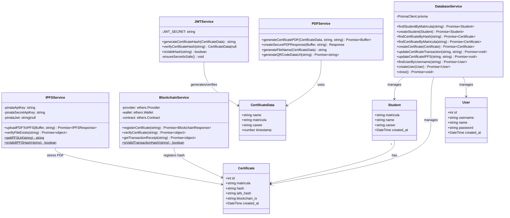

### Servicios y Dependencias

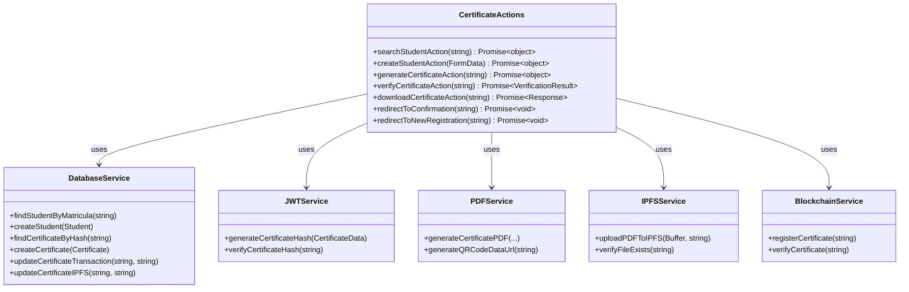

---

## Arquitectura de Servicios

### Diagrama de Servicios y Comunicación

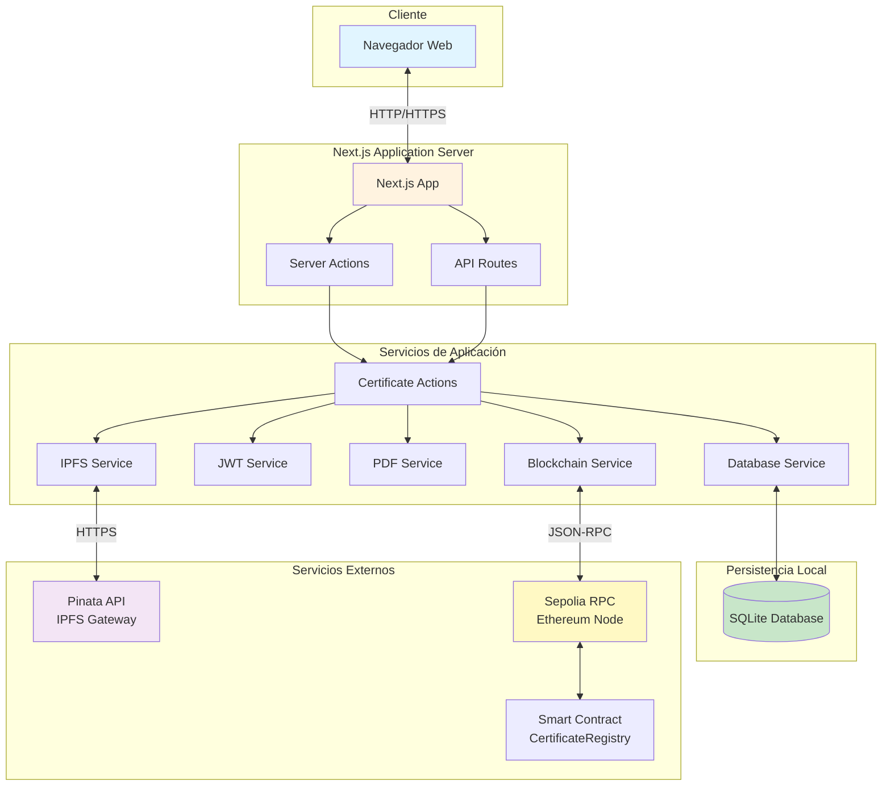

### Flujo de Comunicación entre Servicios

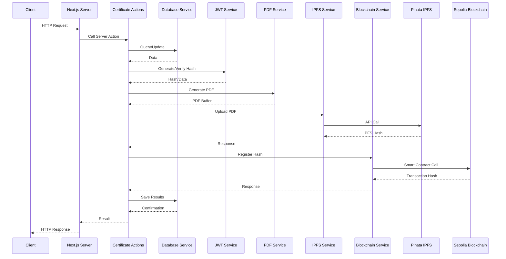

---

## Flujo de Datos Detallado

### Flujo de Datos: Generación Completa

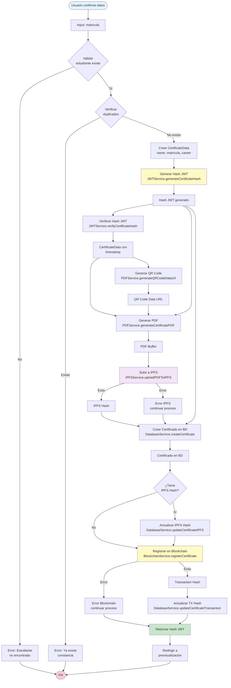

### Flujo de Datos: Verificación Completa

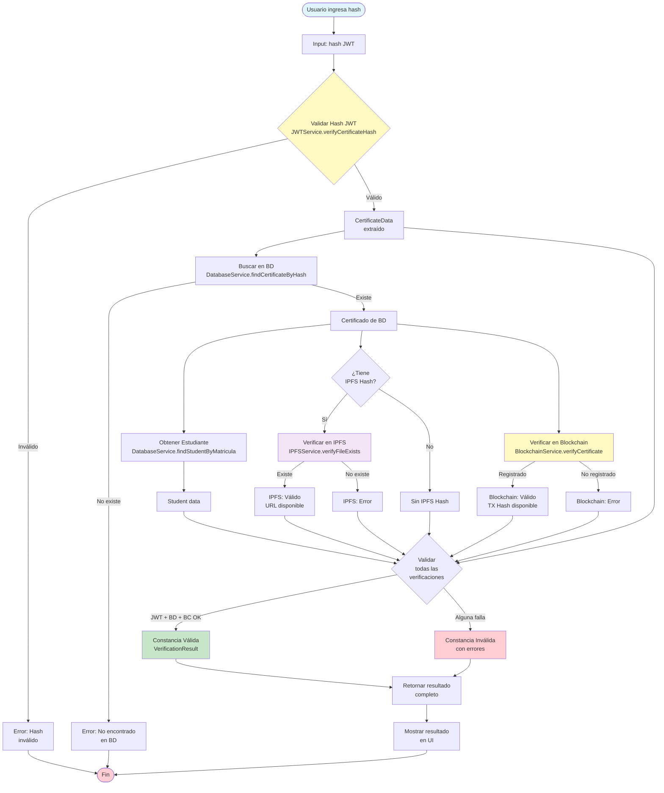

---

## Diagrama de Estados

### Estados de un Certificado

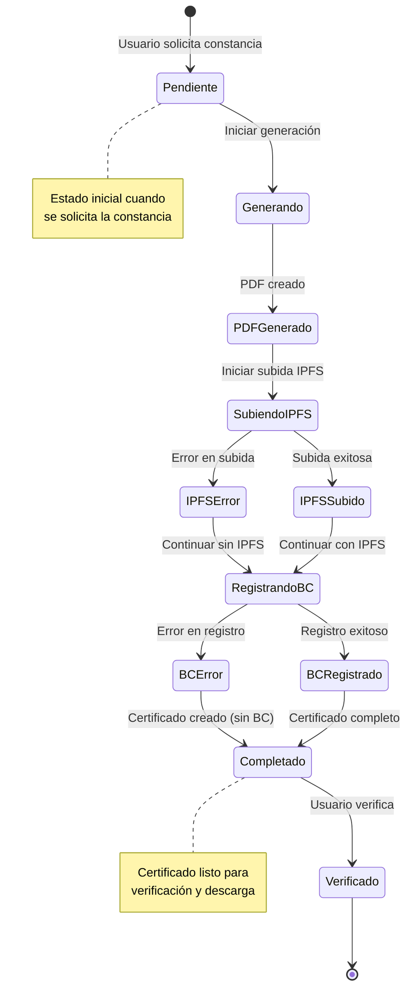

### Estados de Verificación

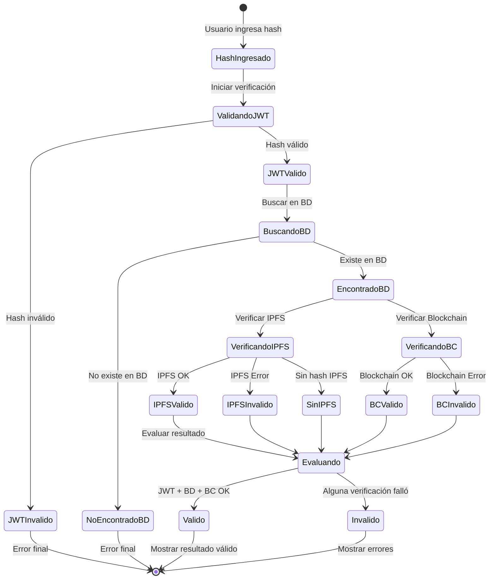

---

## Arquitectura de Despliegue

### Diagrama de Despliegue

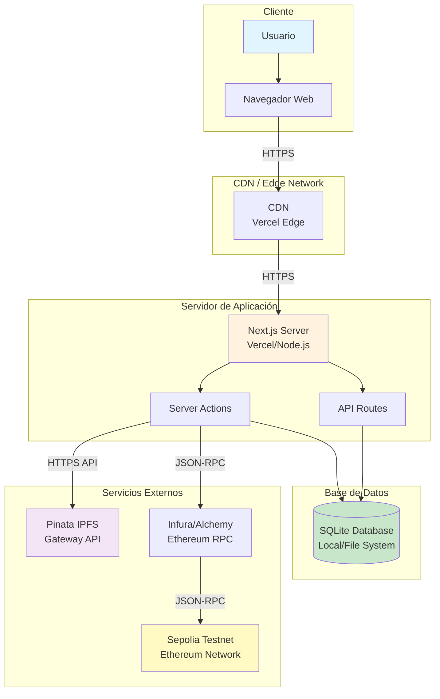

### Arquitectura de Red

```mermaid
graph LR
    subgraph "Internet"
        Internet[Internet]
    end
    
    subgraph "Cliente"
        Client[Cliente Web]
    end
    
    subgraph "Servidor de Aplicación"
        LoadBalancer[Load Balancer]
        App1[App Instance 1]
        App2[App Instance 2]
        App3[App Instance N]
    end
    
    subgraph "Almacenamiento"
        DB[(SQLite DB)]
        FileStorage[File Storage]
    end
    
    subgraph "Servicios Externos"
        IPFS[IPFS Network]
        Blockchain[Blockchain Network]
    end
    
    Client -->|HTTPS| Internet
    Internet -->|HTTPS| LoadBalancer
    LoadBalancer --> App1
    LoadBalancer --> App2
    LoadBalancer --> App3
    
    App1 --> DB
    App2 --> DB
    App3 --> DB
    
    App1 --> FileStorage
    App2 --> FileStorage
    App3 --> FileStorage
    
    App1 -->|API| IPFS
    App2 -->|API| IPFS
    App3 -->|API| IPFS
    
    App1 -->|RPC| Blockchain
    App2 -->|RPC| Blockchain
    App3 -->|RPC| Blockchain
    
    style Client fill:#e1f5ff
    style LoadBalancer fill:#fff3e0
    style DB fill:#c8e6c9
    style IPFS fill:#f3e5f5
    style Blockchain fill:#fff9c4
```

---

## Modelo de Datos Detallado

### Esquema de Base de Datos

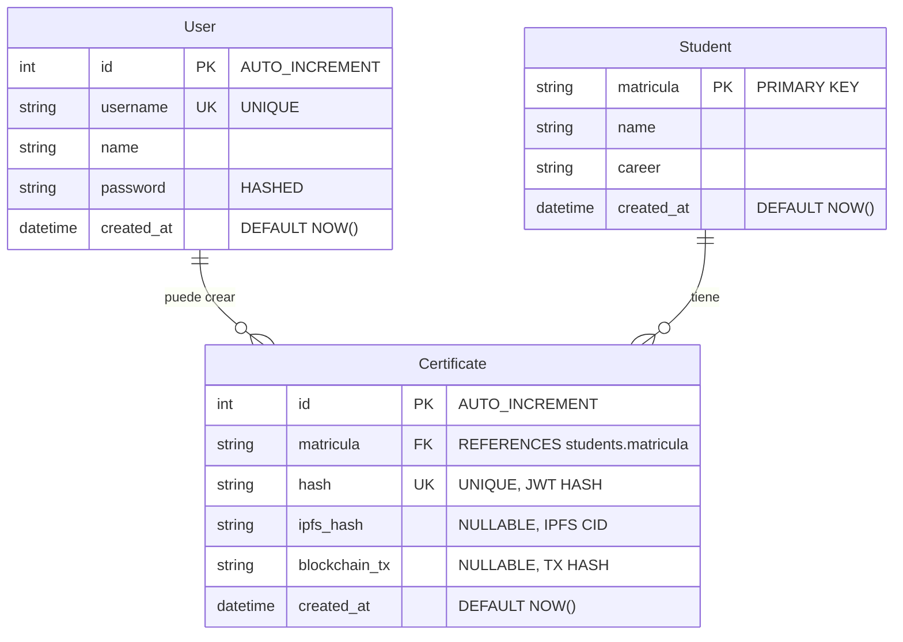

### Relaciones y Constraints

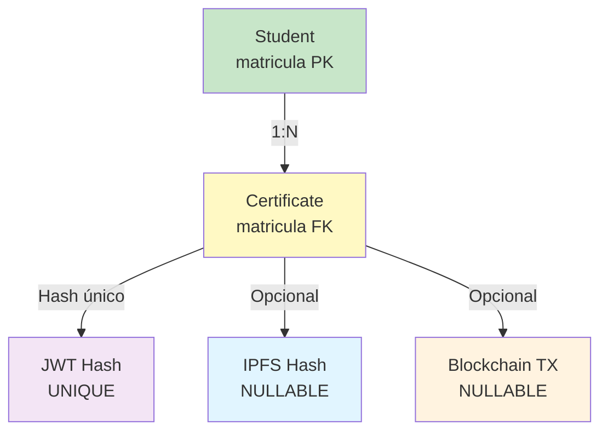

---

## Flujo de Autenticación y Autorización

### Proceso de Validación

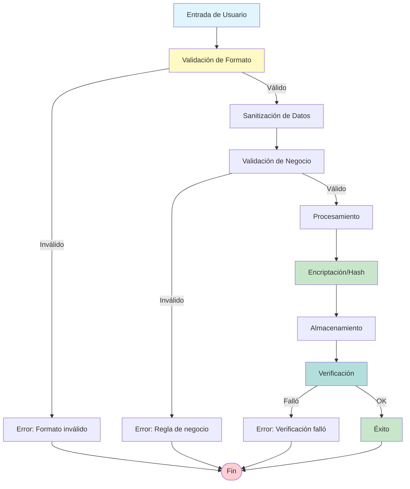

---

## Resumen de Integraciones

### Integraciones Externas

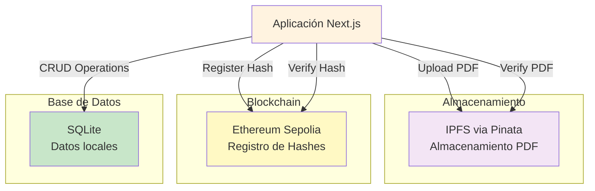

---

**Versión**: 1.0  
**Fecha**: 2024  
**Sistema**: Gestión de Constancias UJAT


