# Documentación del Sistema de Gestión de Constancias de Servicio Social UJAT

## 📋 Índice

1. [Resumen Ejecutivo](#resumen-ejecutivo)
2. [Arquitectura del Sistema](#arquitectura-del-sistema)
3. [Modelo de Datos](#modelo-de-datos)
4. [Flujos de Proceso](#flujos-de-proceso)
5. [Diagramas de Secuencia](#diagramas-de-secuencia)
6. [Componentes del Sistema](#componentes-del-sistema)
7. [Entradas y Salidas](#entradas-y-salidas)
8. [Tecnologías Utilizadas](#tecnologías-utilizadas)

---

## Resumen Ejecutivo

El **Sistema de Gestión de Constancias de Servicio Social** es una aplicación web desarrollada para la Universidad Juárez Autónoma de Tabasco (UJAT) que permite:

- **Registrar estudiantes** en el sistema
- **Generar constancias digitales** con firma criptográfica
- **Almacenar constancias** en IPFS (almacenamiento descentralizado)
- **Registrar hashes** en Blockchain (Ethereum Sepolia Testnet) para garantizar inmutabilidad
- **Verificar la autenticidad** de constancias mediante múltiples validaciones
- **Descargar constancias** en formato PDF con código QR

### Características Principales

✅ **Seguridad Criptográfica**: Uso de JWT para generar hashes únicos e inmutables  
✅ **Almacenamiento Descentralizado**: IPFS para almacenar PDFs de forma permanente  
✅ **Registro Inmutable**: Blockchain para garantizar la autenticidad  
✅ **Verificación Multi-capa**: Validación en base de datos, IPFS y Blockchain  
✅ **Interfaz Moderna**: UI/UX con React, Next.js y Tailwind CSS  

---

## Arquitectura del Sistema

### Diagrama de Arquitectura General

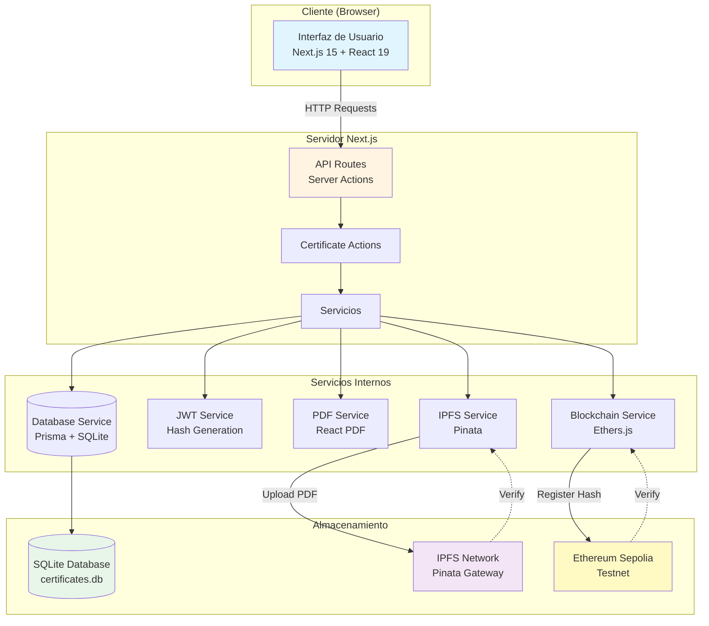

### Arquitectura de Capas

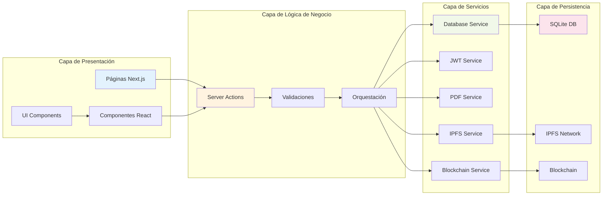

---

## Modelo de Datos

### Diagrama Entidad-Relación

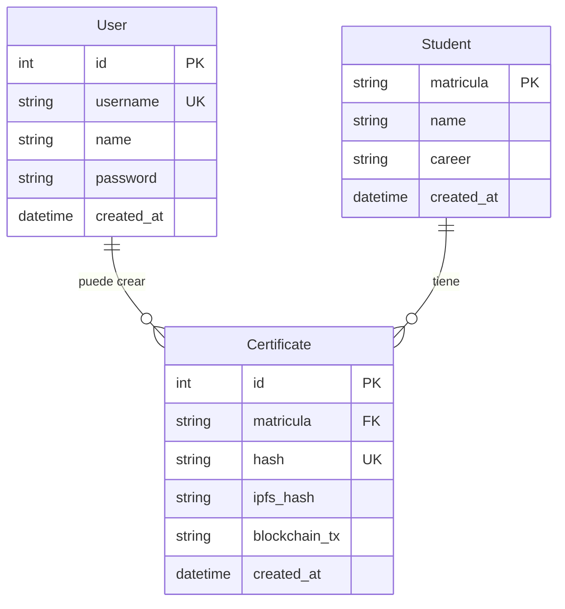

### Esquema de Base de Datos

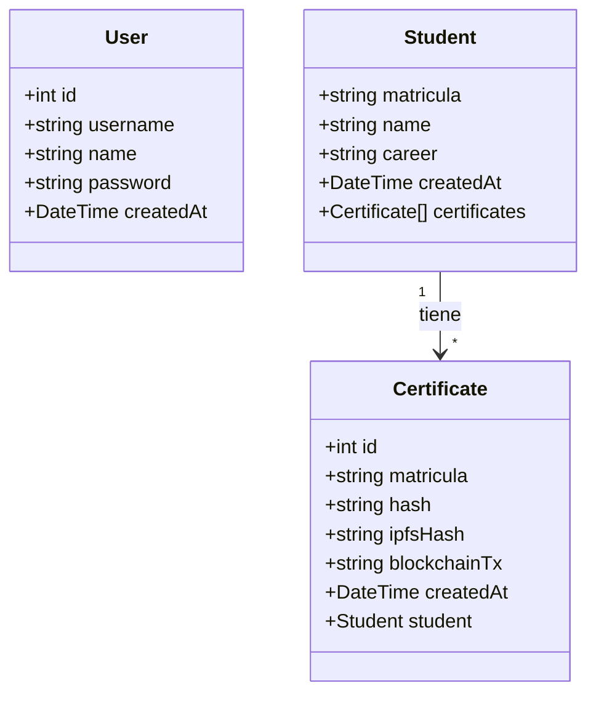

---

## Flujos de Proceso

### 1. Flujo de Búsqueda y Registro de Estudiante

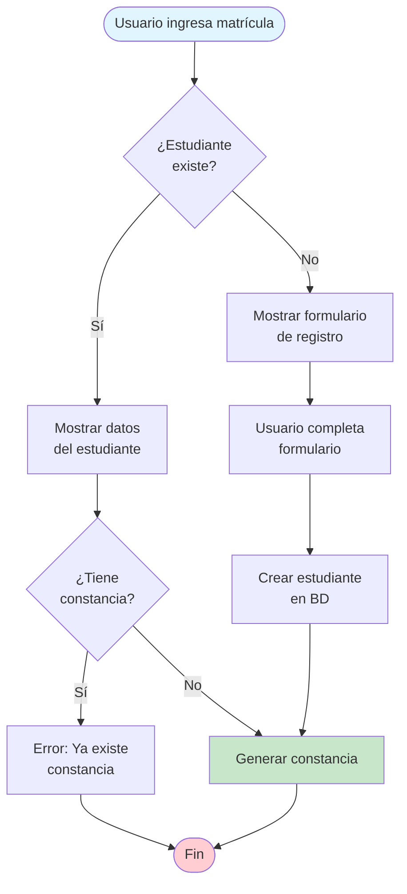

### 2. Flujo de Generación de Constancia

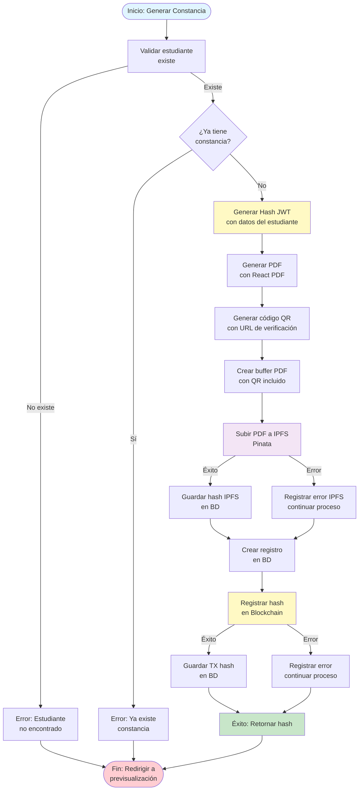

### 3. Flujo de Verificación de Constancia

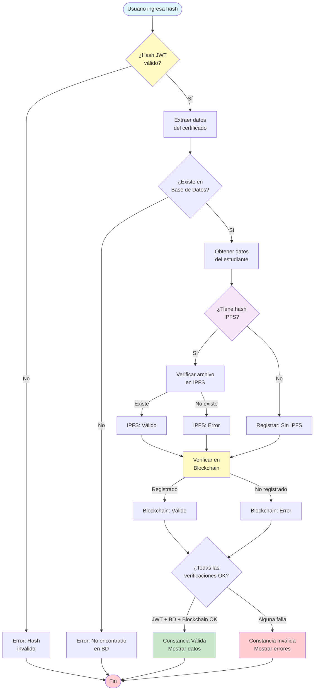

### 4. Flujo de Descarga de Constancia

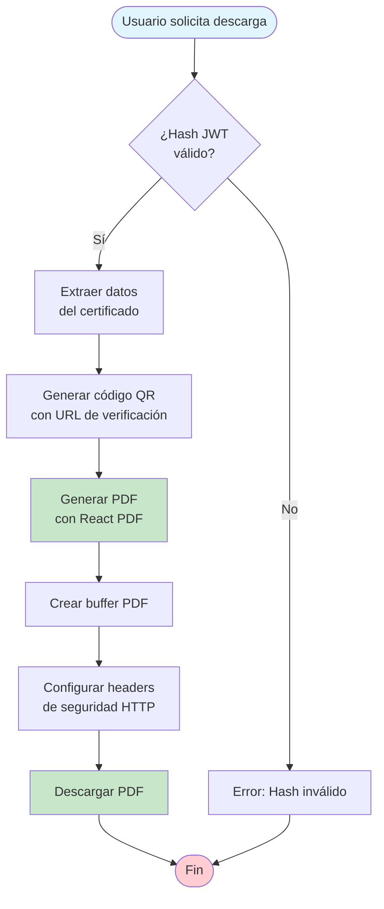

---

## Diagramas de Secuencia

### 1. Secuencia: Generación de Constancia

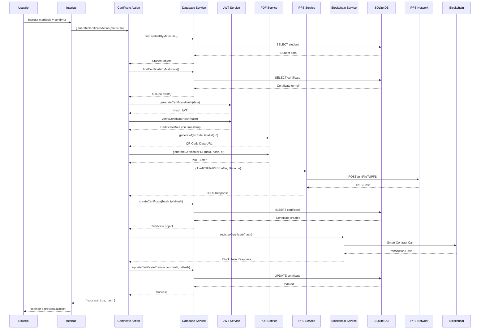

### 2. Secuencia: Verificación de Constancia

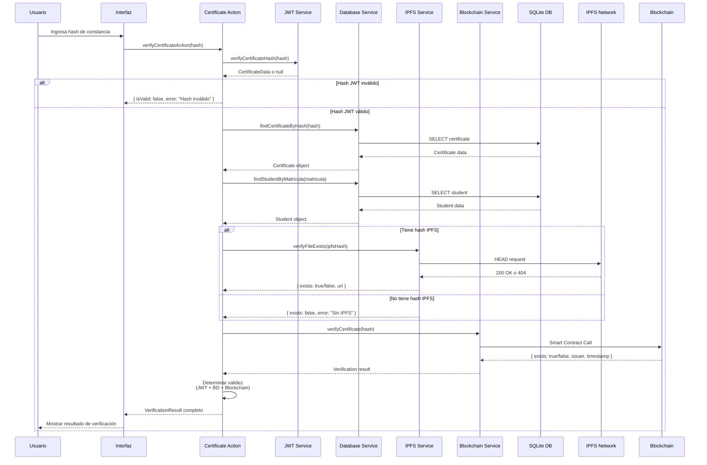

### 3. Secuencia: Descarga de Constancia

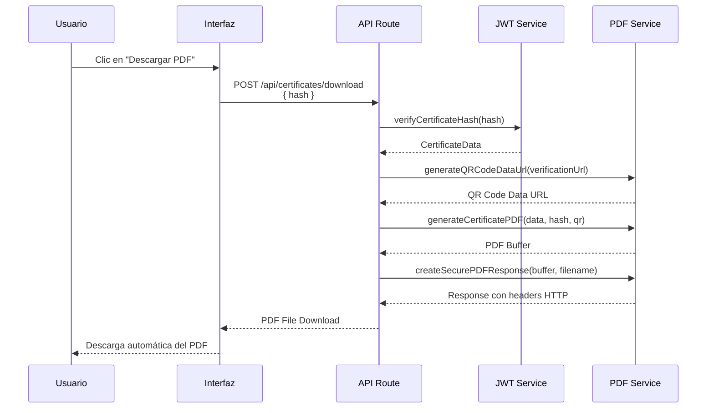

---

## Componentes del Sistema

### Diagrama de Componentes

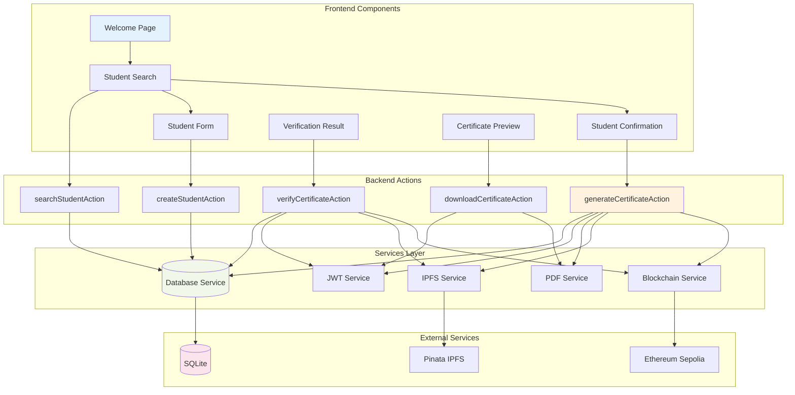

### Estructura de Componentes React

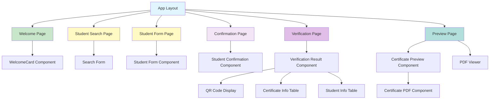

---

## Entradas y Salidas

### Entradas del Sistema

#### 1. Registro de Estudiante
- **Entrada**: 
  - `matricula` (string): Matrícula del estudiante
  - `name` (string): Nombre completo del estudiante
  - `career` (string): Carrera del estudiante
- **Validaciones**:
  - Todos los campos son requeridos
  - Matrícula debe ser única
  - Matrícula se normaliza a mayúsculas

#### 2. Búsqueda de Estudiante
- **Entrada**: 
  - `matricula` (string): Matrícula a buscar
- **Validaciones**:
  - Matrícula no puede estar vacía
  - Se normaliza a mayúsculas

#### 3. Generación de Constancia
- **Entrada**: 
  - `matricula` (string): Matrícula del estudiante
- **Validaciones**:
  - Estudiante debe existir
  - No debe tener constancia previa
- **Procesamiento**:
  - Genera hash JWT con datos del estudiante
  - Crea PDF con código QR
  - Sube a IPFS
  - Registra en Blockchain

#### 4. Verificación de Constancia
- **Entrada**: 
  - `hash` (string): Hash JWT de la constancia
- **Validaciones**:
  - Hash debe ser válido (formato JWT)
  - Hash debe existir en base de datos
- **Procesamiento**:
  - Verifica JWT
  - Busca en base de datos
  - Verifica en IPFS
  - Verifica en Blockchain

#### 5. Descarga de Constancia
- **Entrada**: 
  - `hash` (string): Hash JWT de la constancia
- **Validaciones**:
  - Hash debe ser válido
- **Procesamiento**:
  - Genera PDF dinámicamente
  - Retorna archivo PDF con headers de seguridad

### Salidas del Sistema

#### 1. Respuesta de Búsqueda
```typescript
{
  student: Student | null
}
```

#### 2. Respuesta de Registro
```typescript
{
  success: boolean
  student?: Student
}
```

#### 3. Respuesta de Generación
```typescript
{
  success: boolean
  hash?: string
  error?: string
}
```

#### 4. Respuesta de Verificación
```typescript
{
  isValid: boolean
  certificateData?: CertificateData
  certificate?: Certificate
  student?: Student
  ipfsVerified?: boolean
  ipfsUrl?: string
  blockchainVerified?: boolean
  blockchainTx?: string
  error?: string
}
```

#### 5. Descarga de PDF
- **Tipo**: `application/pdf`
- **Headers de Seguridad**:
  - `Content-Disposition: attachment`
  - `Content-Security-Policy: default-src 'none'`
  - `X-Content-Type-Options: nosniff`
  - `X-Frame-Options: DENY`
  - `Cache-Control: no-cache, no-store, must-revalidate`

---

## Tecnologías Utilizadas

### Frontend
- **Next.js 15.5.2**: Framework React con App Router
- **React 19.1.0**: Biblioteca de UI
- **TypeScript 5**: Tipado estático
- **Tailwind CSS 4**: Estilos
- **Framer Motion**: Animaciones
- **React Hook Form**: Manejo de formularios
- **Zod**: Validación de esquemas
- **Sonner**: Notificaciones toast

### Backend
- **Next.js Server Actions**: Lógica del servidor
- **Prisma 6.13.0**: ORM para base de datos
- **SQLite**: Base de datos relacional
- **jsonwebtoken**: Generación y verificación de JWT

### Servicios Externos
- **IPFS (Pinata)**: Almacenamiento descentralizado de PDFs
- **Ethereum Sepolia**: Blockchain para registro inmutable
- **Ethers.js 6.15.0**: Interacción con blockchain

### Generación de Documentos
- **React PDF (@react-pdf/renderer)**: Generación de PDFs
- **QRCode**: Generación de códigos QR

### Utilidades
- **Axios**: Cliente HTTP
- **Form-Data**: Manejo de formularios multipart
- **Date-fns**: Manipulación de fechas

---

## Flujo de Datos Completo

### Diagrama de Flujo de Datos (DFD)

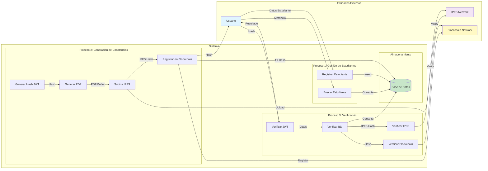

---

## Casos de Uso

### Diagrama de Casos de Uso

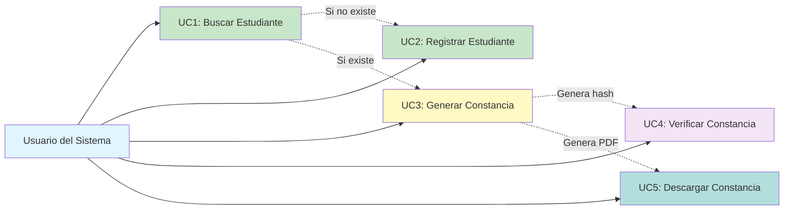

---

## Seguridad

### Medidas de Seguridad Implementadas

1. **JWT con Secret Key**: Hashes firmados criptográficamente
2. **Headers HTTP de Seguridad**: 
   - Content-Security-Policy
   - X-Content-Type-Options
   - X-Frame-Options
   - Cache-Control
3. **Validación de Entradas**: Validación en cliente y servidor
4. **Almacenamiento Seguro**: Variables de entorno para secretos
5. **Registro Inmutable**: Blockchain garantiza autenticidad
6. **Verificación Multi-capa**: JWT + BD + IPFS + Blockchain

### Flujo de Seguridad

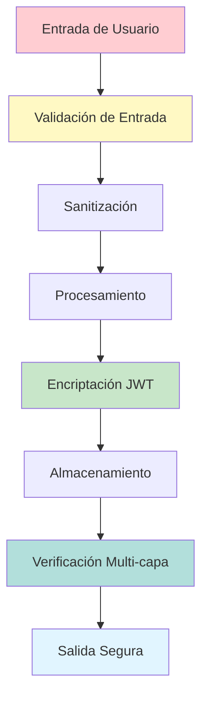

---

## Conclusión

Este sistema proporciona una solución completa y segura para la gestión de constancias de servicio social, utilizando tecnologías modernas y mejores prácticas de seguridad. La integración con IPFS y Blockchain garantiza la autenticidad e inmutabilidad de los documentos generados.

### Características Destacadas

✅ **Arquitectura Modular**: Separación clara de responsabilidades  
✅ **Escalabilidad**: Diseño preparado para crecimiento  
✅ **Seguridad**: Múltiples capas de validación y verificación  
✅ **Trazabilidad**: Registro completo en Blockchain  
✅ **Disponibilidad**: Almacenamiento descentralizado en IPFS  
✅ **Usabilidad**: Interfaz intuitiva y moderna  

---

**Versión del Documento**: 1.0  
**Fecha**: 2024  
**Autor**: Sistema de Gestión de Constancias UJAT


