# Resumen Visual del Sistema - Constancias UJAT

## 🎯 Visión General del Sistema

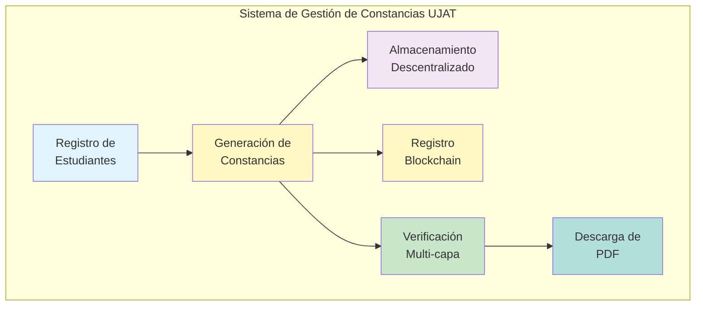

---

## 📊 Arquitectura de Alto Nivel

### Vista General del Sistema

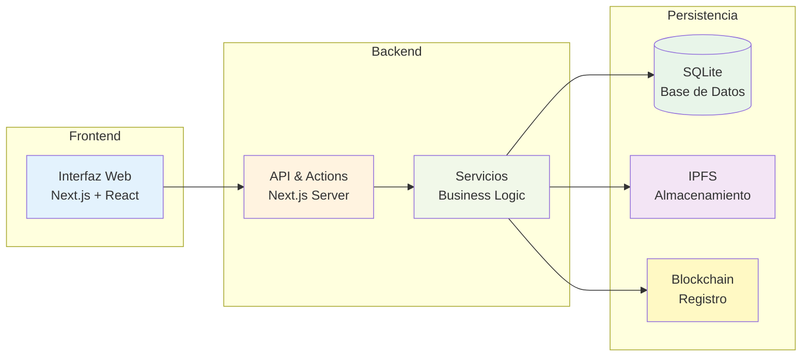

---

## 🔄 Procesos Principales

### 1. Proceso de Generación de Constancia

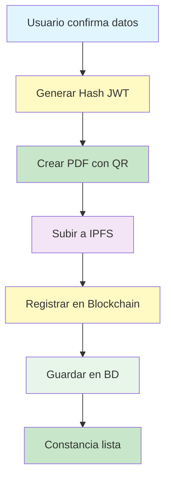

### 2. Proceso de Verificación

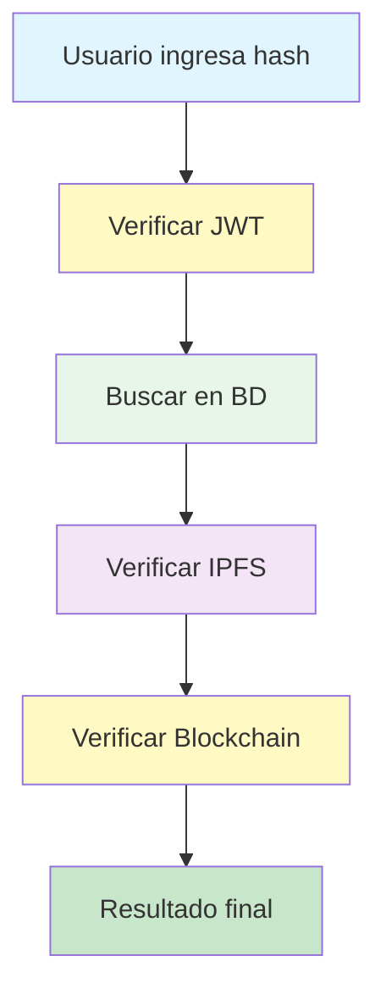

---

## 📦 Componentes del Sistema

### Estructura de Componentes

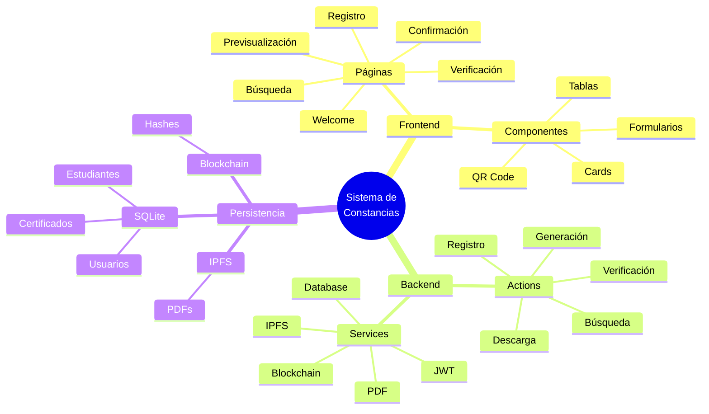

---

## 🔐 Seguridad y Validación

### Capas de Seguridad

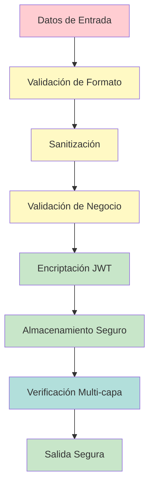

### Verificación Multi-capa

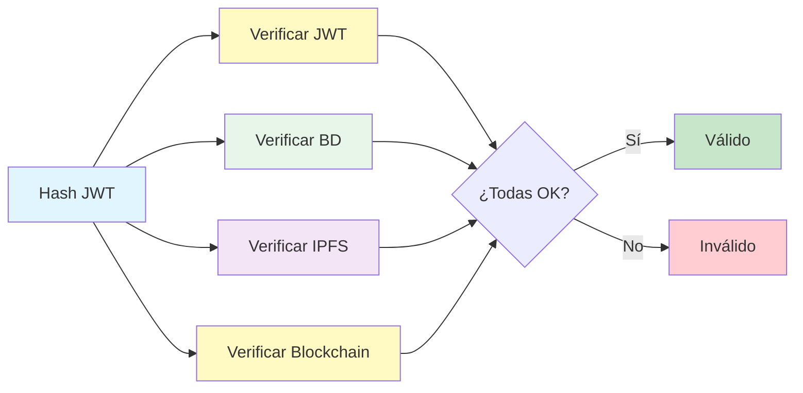

---

## 📈 Flujo de Datos Simplificado

### Flujo Completo del Sistema

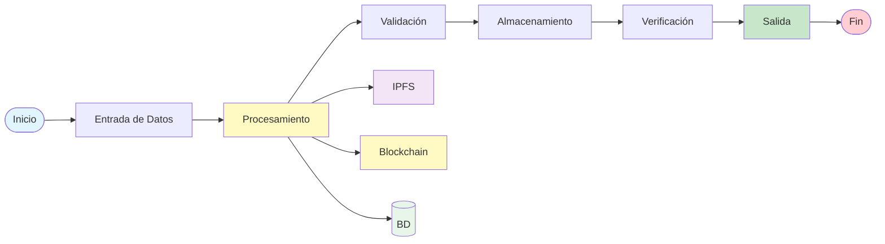

---

## 🎨 Interfaz de Usuario

### Navegación del Sistema

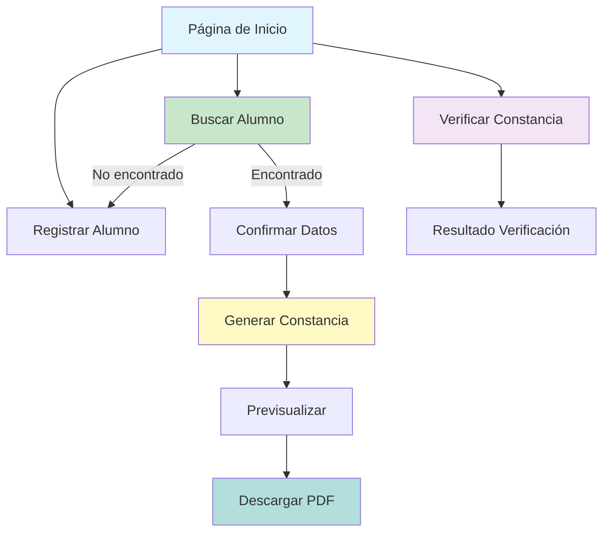

---

## 🔧 Tecnologías Utilizadas

### Stack Tecnológico

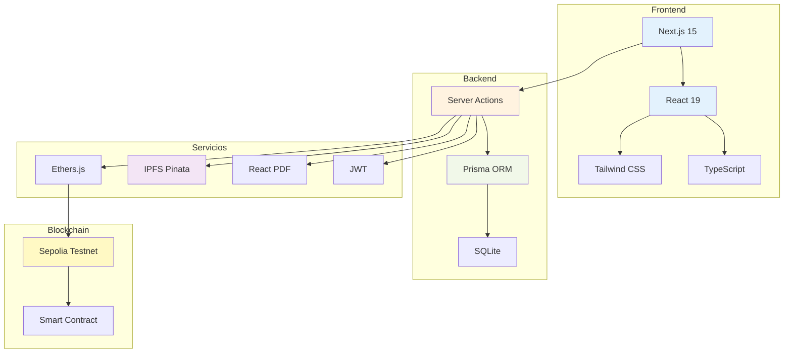

---

## 📋 Casos de Uso Principales

### Diagrama de Casos de Uso Simplificado

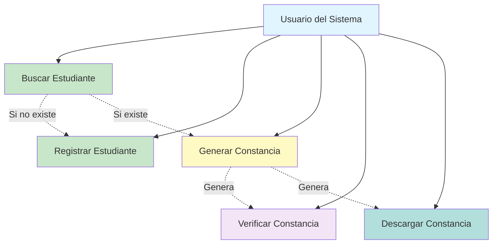

---

## 🎯 Características Clave

### Funcionalidades Principales

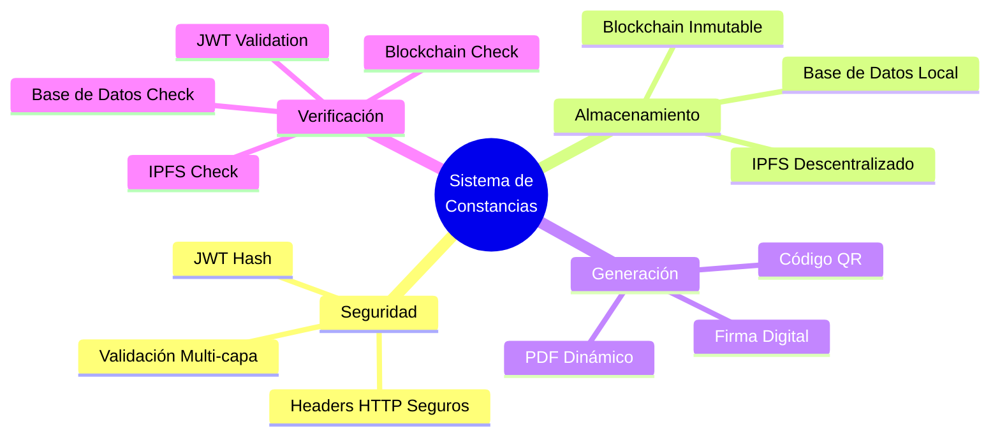

---

## 📊 Métricas y Estados

### Estados del Sistema

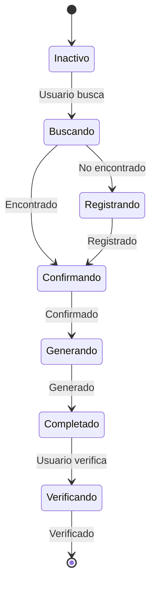

---

## 🔄 Ciclo de Vida de una Constancia

### Ciclo Completo

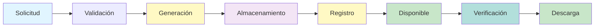

---

## 📝 Resumen Ejecutivo

### Entradas del Sistema
- ✅ Matrícula de estudiante
- ✅ Datos del estudiante (nombre, carrera)
- ✅ Hash JWT para verificación

### Procesos Principales
1. **Registro**: Crear estudiante en base de datos
2. **Generación**: Crear constancia con hash único
3. **Almacenamiento**: Subir PDF a IPFS
4. **Registro**: Guardar hash en Blockchain
5. **Verificación**: Validar en múltiples capas
6. **Descarga**: Generar PDF dinámicamente

### Salidas del Sistema
- ✅ Constancia en formato PDF
- ✅ Hash JWT único
- ✅ Hash IPFS del PDF
- ✅ Transacción Blockchain
- ✅ Resultado de verificación completo

### Tecnologías Clave
- **Frontend**: Next.js 15, React 19, TypeScript
- **Backend**: Next.js Server Actions, Prisma
- **Base de Datos**: SQLite
- **Almacenamiento**: IPFS (Pinata)
- **Blockchain**: Ethereum Sepolia Testnet
- **Seguridad**: JWT, Validación multi-capa

---

**Versión**: 1.0  
**Sistema**: Gestión de Constancias de Servicio Social UJAT  
**Fecha**: 2024

